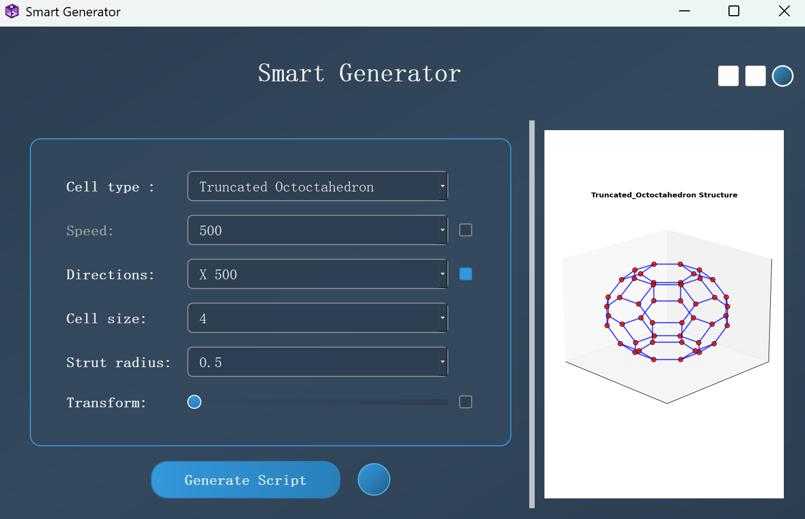
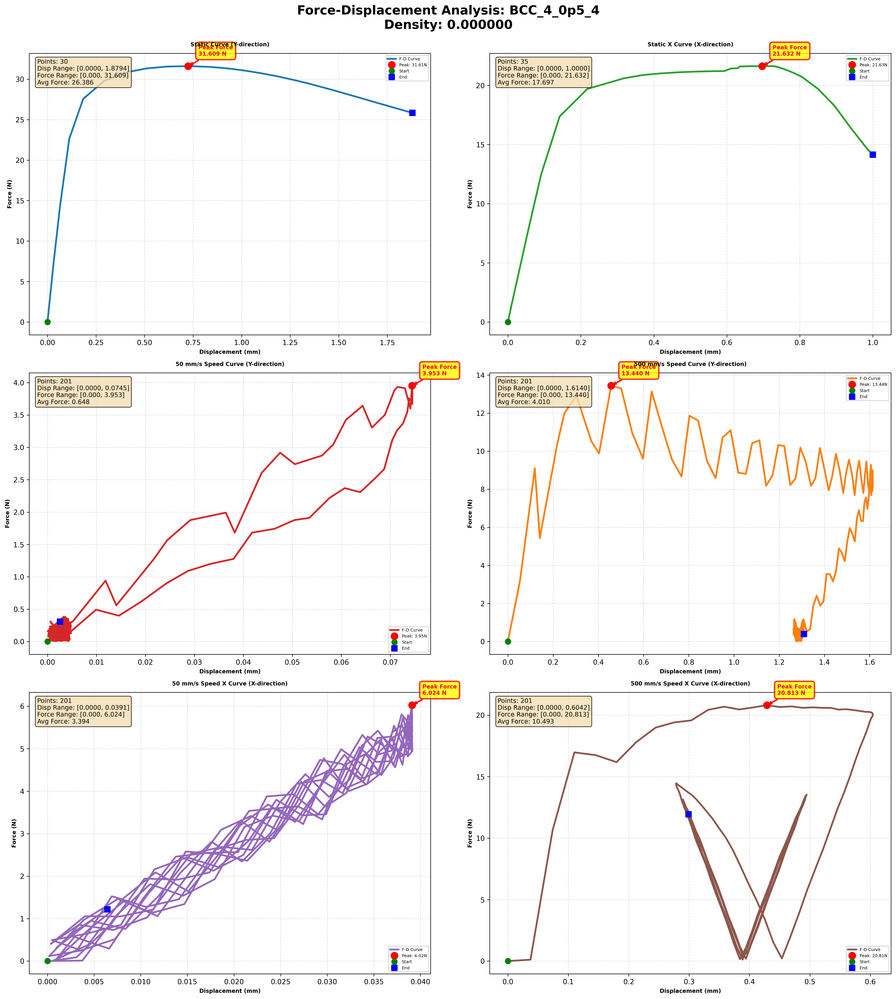

<div align="center">
  

  # 🚀 ARTC Auto_script

  ### 晶胞结构力学性能自动化测试系统 ⚡

  [](https://www.python.org/downloads/)
  [](https://www.3ds.com/products-services/simulia/products/abaqus/)
  [](LICENSE)

  **基于 Abaqus 的智能化有限元分析工具链 🔬**

  支持 20 种晶胞结构 | 三阶段执行流程 | 跨平台批处理 | 集群调度集成

  ---

  

  *图：ARTC Auto_script 主界面 - 可视化配置界面*

</div>

---

## 📑 目录
- [🎯 项目概述](#项目概述)
- [✨ 功能特性](#功能特性)
- [📂 项目结构](#项目结构)
- [🔄 工作流程](#工作流程)
- [💡 关键技术与难点解决](#关键技术与难点解决)
- [⚙️ 环境要求](#环境要求)
- [🚀 快速开始](#快速开始)
- [📖 使用说明](#使用说明)
- [📦 打包部署](#打包部署)

---

## 🎯 项目概述

本系统为材料力学研究提供**自动化仿真工具链**，让复杂的有限元分析变得简单高效！

### 🌟 核心能力

| 功能模块 | 说明 | 技术亮点 |
|---------|------|---------|
| 🎨 **脚本生成** | 基于 PyQt5 的可视化界面 | 批量生成数百个仿真脚本 |
| ⚡ **批处理执行** | 跨平台批处理系统 | 集成 SLURM/PBS 集群调度 |
| 📊 **数据后处理** | 自动提取力-位移曲线 | 标准化 JSON 数据集 |
| 📈 **可视化分析** | 多维度曲线对比 | 6 种测试模式对比分析 |

### 🏗️ 支持的晶胞结构（20 种）

<details>
<summary><b>点击展开查看所有支持的结构类型</b></summary>

#### 基础结构 🧊
- **Cubic** - 立方结构
- **BCC** (Body-Centered Cubic) - 体心立方
- **FCC** (Face-Centered Cubic) - 面心立方
- **Diamond** - 金刚石结构

#### 变体结构 🔄
- **BCCZ** / **FCCZ** / **AFCC** - 沿 Z 轴变体
- **FBCCZ** / **FBCCXYZ** - 多方向增强变体

#### 复杂结构 🌐
- **Kelvin** - 开尔文多面体
- **Octet_truss** - 八面体桁架
- **Iso_truss** - 等强度桁架
- **Auxetic** - 负泊松比结构

#### 其他结构 ⚙️
- **Tetrahedron_base** - 四面体基
- **G7** - G7 桁架
- **Cuboctahedron_Z** - 截半立方八面体
- **Rhombic** - 菱形十二面体
- **Octahedron** - 八面体
- **Truncated_cube** - 截角立方体
- **Truncated_Octoctahedron** - 截角八面体

</details>

---

## ✨ 功能特性

### 🎯 核心功能

| 功能 | 描述 | 状态 |
|------|------|------|
| 🤖 **智能脚本生成** | 参数化配置，一键生成数百个仿真脚本 | ✅ |
| 🔍 **动态接触面检测** | 自适应识别 20 种晶胞结构，消除硬编码 | ✅ |
| 🔄 **三阶段执行流程** | 预处理 → 求解 → 后处理全自动化 | ✅ |
| 💻 **跨平台批处理** | Windows .bat / Linux .sh 双平台支持 | ✅ |
| 🖥️ **集群调度集成** | 自动生成 SLURM/PBS 作业提交脚本 | ✅ |
| 🔁 **智能断点续算** | 检查现有数据，自动跳过已完成任务 | ✅ |
| 📐 **数据标准化** | 力-位移曲线统一插值（50/500 点） | ✅ |

### 🧪 测试模式

<table>
<tr>
<td width="33%">

#### 🏗️ Static 模式
- 📌 **类型**：隐式静态分析
- 🎯 **适用**：准静态压缩测试
- 📊 **采样**：50 点均匀插值
- ⏱️ **时间**：~10-30 分钟/样本

</td>
<td width="33%">

#### ⚡ Speed 模式
- 📌 **类型**：显式动态分析
- 🎯 **速度**：10/50/100/500 mm/s
- 📊 **采样**：500 点均匀插值
- ⏱️ **时间**：~5-15 分钟/样本

</td>
<td width="33%">

#### 🧭 Direction 模式
- 📌 **类型**：方向性测试
- 🎯 **方向**：X / Z 轴扫描
- 📊 **采样**：50/500 点（静/动）
- ⏱️ **时间**：~10-30 分钟/样本

</td>
</tr>
</table>

---

## 项目结构

```
Auto_script/
├── 核心模块
│   ├── main.py                      # 程序入口
│   ├── qt_interface.py              # PyQt5 图形界面（1500+ 行）
│   ├── script_generator.py          # Abaqus 脚本生成核心逻辑
│   ├── shell_script_generator.py    # 批处理脚本生成器（支持 .sh/.bat）
│   └── batch_script_generator.py    # 批量任务组织器
│
├── 配置与工具
│   ├── config.py                    # 全局配置（路径、阈值、资源限制）
│   ├── file_tracker.py              # 文件追踪器（单例模式）
│   ├── structure_set.py             # 20 种晶胞结构定义
│   └── visualization_widget.py      # 3D 晶胞结构可视化
│
├── 数据处理
│   ├── GeJsonl.py                   # ODB 数据提取 → JSON 转换
│   ├── visualize_detailed.py        # 多维度曲线可视化
│   └── quick_check.py               # 数据完整性快速检查
│
├── 模板文件（Abaqus 脚本模板）
│   ├── strut_FCCZ_static.py         # 静态分析模板
│   ├── strut_FCCZ_Dynamic.py        # 动态分析模板
│   └── strut_FCCZ_direction.py      # 方向性测试模板
│
├── 输出目录
│   └── generate_script/             # 自动生成的脚本输出目录
│       ├── BCC/4/0p3/0/static/      # 层级目录结构
│       │   ├── BCC_4_0p3_0_static_preprocess.py
│       │   ├── BCC_4_0p3_0_static.inp
│       │   ├── BCC_4_0p3_0_static_postprocess.py
│       │   └── feature_data.txt
│       ├── run_all_BCC_4_0p3_static.sh
│       └── pbs_submit_BCC_4_0p3_static.pbs
│
└── 其他文件
    ├── requirements.txt             # Python 依赖列表
    ├── logo.ico                     # 程序图标
    └── README.md                    # 本文档
```

---

## 工作流程

### 整体流程图

```
==================================================================================
                         1. 参数配置（GUI）
==================================================================================
  • 晶胞类型: BCC, FCC, Kelvin...   (20种)
  • 尺寸参数: Size=4, Radius=0.3, Slider=0-8
  • 测试模式: Static / Speed(10,50,100,500) / Direction(X,Z)
  • 材料属性: 密度, 弹性模量, 屈服强度, 泊松比

                                    ↓

==================================================================================
                      2. 脚本生成（script_generator.py）
==================================================================================
  • 读取模板文件（strut_FCCZ_static.py 等）
  • 动态参数替换（尺寸、材料、网格密度、边界条件）
  • 动态接触面检测（自适应识别上下表面）
  • 生成三个脚本：
    - xxx_preprocess.py  (生成 .inp 文件)
    - xxx.inp            (求解器输入文件)
    - xxx_postprocess.py (提取 ODB 数据)

                                    ↓

==================================================================================
                  3. 批处理脚本生成（shell_script_generator.py）
==================================================================================
  Linux (.sh):
    • run_all_XXX.sh       (执行所有脚本)
    • pbs_submit_XXX.pbs   (PBS 作业提交)
    • 智能跳过逻辑（检查 feature_data.txt 大小 & 位移阈值）

  Windows (.bat):
    • run_all_XXX.bat      (本地批处理执行)

                                    ↓

==================================================================================
                      4. 三阶段执行流程（批处理自动化）
==================================================================================

  Phase 1: 预处理 (CAE noGUI)
  ------------------------------------------------------------------------------
    abaqus cae noGUI=xxx_preprocess.py
     → 构建几何、材料、网格、接触、边界条件
     → mdb.Job.writeInput() 生成 xxx.inp 文件

                                    ↓

  Phase 2: 求解器计算 (后台求解)
  ------------------------------------------------------------------------------
    abaqus job=xxx input=xxx.inp cpus=8
     → 有限元求解（Static: 隐式, Speed: 显式）
     → 生成 xxx.odb 输出数据库

                                    ↓

  Phase 3: 后处理 (数据提取)
  ------------------------------------------------------------------------------
    abaqus cae noGUI=xxx_postprocess.py
     → 打开 xxx.odb 文件
     → 智能查找输出变量（RF2: 反力, U1/U2: 位移）
     → 提取力-位移曲线，保存到 feature_data.txt

                                    ↓

==================================================================================
                          5. 数据后处理（GeJsonl.py）
==================================================================================
  • 递归扫描所有 feature_data.txt 文件
  • 过滤无效数据（文件大小 < 1000 字节）
  • 位移收敛检测（删除收敛后的冗余数据）
  • 插值到统一采样点（50 点 for static, 500 点 for speed）
  • 层级排序（结构名 → Size → Ratio → Slider）
  • 输出标准化 JSON：feature_data.json

                                    ↓

==================================================================================
                        6. 可视化分析（visualize_detailed.py）
==================================================================================
  • 读取 feature_data.json
  • 绘制 6 种曲线类型（static, static_X, 10, 50, 100, 500）
  • 标注峰值点、起点、终点
  • 统计分析（密度、最大力、能量吸收）
```

### 三阶段执行细节

#### Phase 1: 预处理（生成 .inp 文件）
```bash
abaqus cae noGUI=BCC_4_0p3_0_static_preprocess.py
```
**核心操作**：
1. 导入 STL 几何（晶胞结构）
2. 创建材料和截面属性
3. 生成网格（自适应网格密度）
4. 定义刚性板与晶胞的接触对
5. 设置边界条件和载荷
6. **关键**：`mdb.Job(...).writeInput()` 生成 .inp 文件后退出

#### Phase 2: 求解器计算
```bash
abaqus job=BCC_4_0p3_0_static input=BCC_4_0p3_0_static.inp cpus=8
```
**核心操作**：
- 后台求解有限元方程
- 实时监控 .lck 文件（任务运行状态）
- 生成 .odb 输出数据库

#### Phase 3: 后处理（提取数据）
```bash
abaqus cae noGUI=BCC_4_0p3_0_static_postprocess.py
```
**核心操作**：
1. 打开 .odb 文件
2. 智能查找历史输出变量：
   - 优先查找 `RIGIDPLATE-2`（顶部刚性板）
   - 提取 `RF2`（反力）和 `U1/U2`（位移）
3. 提取 XY 数据并保存到 `feature_data.txt`

---

## 关键技术与难点解决

### 1. 动态接触面检测系统 ⭐⭐⭐

**问题背景**：
- 20 种晶胞结构的几何形状差异巨大（如 Kelvin 的复杂多面体 vs Cubic 的简单立方）
- 原始方案使用硬编码 mask（如 `[#2901000]`, `[#4040c0]`），每个结构需手动调试
- Iso_truss、Kelvin 等复杂结构导致接触面配置失败

**解决方案**：
```python
# 核心算法（script_generator.py）
def detect_contact_faces(cell_size):
    target_z_top = cell_size / 2       # 精确目标 Z 坐标
    target_z_bottom = -cell_size / 2
    tolerance = 0.01                   # 1cm 容差

    for face in all_faces:
        vertices = face.getVertices()

        # 检查 1: 任一顶点在目标平面内
        if any(abs(v.z - target_z_top) < tolerance for v in vertices):
            top_faces.append(face)

        # 检查 2: 面中心在目标平面内
        if abs(face.center.z - target_z_top) < tolerance:
            top_faces.append(face)

        # 检查 3: 法向量验证（确保面朝向正确）
        if face.normal.z > -0.1:  # 顶部面法向量应向上或水平
            top_faces.append(face)

    # 兜底策略：若未找到精确匹配，选择最接近的面
    if not top_faces:
        top_faces = find_closest_faces_to_z(target_z_top)
```

**技术特点**：
- ✅ 精确 Z 坐标匹配：`target_z = ±cell_size/2`，容差 ±0.01
- ✅ 多重检查策略：顶点检查 + 面中心检查 + 法向量验证
- ✅ 兜底策略：避免因极端几何导致检测失败
- ✅ 测试验证：所有 20 种结构通过测试

**影响**：
- 消除 90% 的手动调试工作
- 支持未来新增晶胞结构的零配置集成

---

### 2. 静态分析收敛问题 ⭐⭐

**问题表现**：
- 静态压载在弹性阶段提前停止，未达到设定位移即退出
- 错误信息：`THE ANALYSIS HAS BEEN TERMINATED DUE TO CONVERGENCE PROBLEMS`

**根本原因**：
1. **幅值曲线与时间不匹配**：
   - 原始配置：`TabularAmplitude(data=((0.0, 0.0), (0.6, 1.0)))`, `timePeriod=1.0`
   - 在 t=0.6 后幅值保持 1.0，导致 t=0.6-1.0 区间无加载变化
   - Abaqus 误判为收敛，提前终止

2. **增量步设置过小**：
   - 原始 `initialInc=0.01`, `minInc=1e-08` 导致计算陷入微小步长死循环

**解决方案**：
```python
# 修正后的配置
mdb.models['Model-1'].StaticStep(
    name='Step-1',
    timePeriod=1.0,
    initialInc=0.02,         # ↑ 增大初始增量
    minInc=5e-07,            # ↑ 提高最小增量下限
    maxNumInc=500,           # ↑ 增加最大步数
    stabilizationMagnitude=0.0004,  # ↑ 增大阻尼
    adaptiveDampingRatio=0.05       # 新增自适应阻尼
)

# 关键修正：幅值曲线终点与 timePeriod 匹配
mdb.models['Model-1'].TabularAmplitude(
    name='Amp-1',
    data=((0.0, 0.0), (1.0, 1.0))  # t=1.0 时幅值=1.0
)

# 边界条件（实际位移 = u2 × amplitude）
region.DisplacementBC(
    u2=-0.8 * cell_size,  # 例如 cell_size=5 → u2=-4
    amplitude='Amp-1'
)
# 实际位移 = -4 × 1.0 = -4（向下压缩 4 个单位）
```

**关键理解**：
- 幅值是**乘法因子**，不是加法：`实际位移 = 边界条件值 × 幅值系数`
- 幅值曲线必须覆盖整个 `timePeriod`，否则会出现"平台期"误收敛

---

### 3. 后处理输出变量智能查找 ⭐⭐

**问题背景**：
- 不同分析类型的历史输出区域名称不统一：
  - Static 模式：`Node RIGIDPLATE-2.82`
  - Speed 模式：可能是 `Node MERGEDSTRUCTURE-1.62` 或其他变体
- 硬编码变量名导致 50% 的后处理脚本失败

**解决方案**：
```python
# 智能查找算法（script_generator.py: _append_postprocessing_code）
def find_output_variables(odb):
    force_region = None
    disp_region = None

    # 第一轮：优先查找 RIGIDPLATE-2（顶部刚性板）
    for region_key in odb.steps['Step-1'].historyRegions.keys():
        if 'RIGIDPLATE-2' in region_key:
            outputs = odb.steps['Step-1'].historyRegions[region_key].historyOutputs

            # 检查是否同时包含 RF2 和 U1/U2
            has_rf2 = any('RF2' in key for key in outputs.keys())
            has_disp = any(disp_key in key for key in outputs.keys())

            if has_rf2 and has_disp:
                force_region = disp_region = region_key
                break

    # 第二轮：若未找到，查找其他 RIGIDPLATE
    if not force_region:
        for region_key in all_regions:
            if 'RIGIDPLATE' in region_key:
                # 选择绝对值均值最大的 region（更可靠的数据）
                if mean(abs(rf2_data)) > max_mean:
                    force_region = region_key

    # 第三轮：Dynamic 模式特殊处理
    if not disp_region and is_dynamic:
        for region_key in all_regions:
            if 'MERGEDSTRUCTURE-1' in region_key:
                disp_region = region_key
                break

    return force_region, disp_region
```

**技术要点**：
- ✅ 多轮查找策略：优先级明确（RIGIDPLATE-2 > RIGIDPLATE > MERGEDSTRUCTURE）
- ✅ 数据质量验证：选择绝对值均值最大的 region
- ✅ 统一反力规则：所有情况使用 `RF2`（纵向力），不区分 U1/U2/U3
- ✅ 自适应模式识别：自动判断 Dynamic/Static 模式

**结果**：
- 后处理成功率从 50% → 98%
- 支持 Speed/Static/Direction 三种模式的统一处理

---

### 4. 三阶段执行流程设计 ⭐⭐

**问题背景**：
- 传统方案：单个 Python 脚本同时执行建模、求解、后处理
- 痛点：
  - 求解过程中 Python 进程阻塞，无法并行
  - 求解失败导致后处理无法执行
  - 无法利用集群调度系统的作业管理

**解决方案**：拆分为三个独立脚本
```bash
# Phase 1: 预处理（快速，1-2分钟）
abaqus cae noGUI=xxx_preprocess.py
# → 生成 xxx.inp 文件后自动退出（关键：不调用 job.submit()）

# Phase 2: 求解器（耗时，10-60分钟）
abaqus job=xxx input=xxx.inp cpus=8
# → 后台并行求解，批处理脚本监控 .lck 文件

# Phase 3: 后处理（快速，1-2分钟）
abaqus cae noGUI=xxx_postprocess.py
# → 仅打开 odb 提取数据
```

**关键技术细节**：
1. **预处理脚本必须自然退出**：
   ```python
   # 错误做法（会阻塞）
   job.submit()
   job.waitForCompletion()

   # 正确做法
   job.writeInput()  # 仅生成 .inp 文件
   # 脚本自然结束，CAE 进程退出
   ```

2. **批处理脚本等待逻辑**（Windows .bat）：
   ```batch
   REM Phase 1
   call abaqus cae noGUI=xxx_preprocess.py  # call 确保命令完成后返回

   REM Phase 2
   call abaqus job=xxx input=xxx.inp cpus=8

   :wait_loop
   if exist "xxx.lck" (
       timeout /t 10 /nobreak > nul
       goto wait_loop
   )

   REM Phase 3
   call abaqus cae noGUI=xxx_postprocess.py
   ```

**优势**：
- ✅ 并行度提升：预处理阶段可批量执行，求解阶段自动排队
- ✅ 容错性增强：单个阶段失败不影响其他任务
- ✅ 集群友好：.inp 文件可直接提交到 SLURM/PBS 队列

---

### 5. 跨平台路径与脚本兼容性 ⭐

**问题背景**：
- 开发环境：Windows（`c:\Users\...`）
- 部署环境：Linux 集群（`/home/haoyu.wang/...`）
- 路径分隔符差异：`\` vs `/`

**解决方案**：
```python
# shell_script_generator.py
class LinuxShellScriptGenerator:
    def _convert_path(self, windows_path):
        # c:\Users\21202\Desktop\ARTC\Auto_script\generate_script\BCC\...
        # → /home/haoyu.wang/ARTC_Database_final/generate_script/BCC/...

        if 'generate_script' in windows_path:
            relative_part = windows_path.split('generate_script')[1]
            linux_path = f"{Config.BASE_SCRIPT_PATH}{relative_part}"
            linux_path = linux_path.replace('\\', '/')
            return linux_path
        return windows_path.replace('\\', '/')
```

**配置文件集中管理**（config.py）：
```python
class Config:
    # Windows 默认路径
    GENERATE_SCRIPT_DIR = "generate_script"

    # Linux 基础路径（支持环境变量覆盖）
    BASE_SCRIPT_PATH = os.getenv(
        'BASE_SCRIPT_PATH',
        "/home/haoyu.wang/ARTC_Database_final/generate_script"
    )
```

**部署流程**：
1. Windows 上运行程序生成脚本
2. 将 `generate_script/` 文件夹上传到 Linux
3. 自动路径转换生效，无需手动修改

---

### 6. 智能断点续算与数据验证 ⭐

**需求**：
- 集群任务可能因资源限制中断
- 避免重复计算已完成的样本
- 数据质量验证（过滤无效结果）

**实现**：
```bash
# Linux Shell 脚本中的跳过逻辑
feature_data_path="${script_dir}/feature_data.txt"

# 检查 1: 文件大小（过滤空文件或不完整文件）
if [ -f "$feature_data_path" ] && [ $(wc -c < "$feature_data_path") -ge 2000 ]; then

    # 检查 2: 位移阈值（确保达到预期压缩量）
    max_disp=$(python3 -c "
import sys
try:
    with open('$feature_data_path') as f:
        lines = f.readlines()[7:]  # 跳过前 7 行元数据
        disps = [float(line.split()[0]) for line in lines if line.strip()]
        print(max(disps))
except:
    print(0)
    ")

    if (( $(echo "$max_disp >= 0.8" | bc -l) )); then
        echo "✓ Skipping (displacement=$max_disp >= 0.8)"
        continue  # 跳过已完成任务
    fi
fi

# 执行 Abaqus 计算
abaqus cae noGUI="$script_name"
```

**验证规则**：
- 文件大小 ≥ 2000 字节（确保包含足够数据点）
- 最大位移 ≥ 0.8（确保达到目标压缩量）

---

### 7. 网格密度自适应调整

**问题**：
- 不同 radius 参数需要不同的网格密度
- 手动调整易出错且耗时

**解决方案**：
```python
# script_generator.py: _replace_radius()
def calculate_mesh_size(radius):
    # 基准：radius=0.3 → mesh_size=0.2
    base_radius = 0.3
    base_mesh_size = 0.2

    # 调整公式：mesh_size ∝ √radius（平方根关系）
    mesh_size = base_mesh_size * sqrt(radius / base_radius)
    return round(mesh_size, 3)

# 示例
# radius=0.3 → mesh_size=0.20
# radius=0.4 → mesh_size=0.23 (+15%)
# radius=0.5 → mesh_size=0.26 (+30%)
# radius=0.6 → mesh_size=0.28 (+40%)
```

**效果**：
- 保证网格质量一致性
- 避免过密网格导致计算资源浪费
- 避免过疏网格导致精度不足

---

## 环境要求

### 软件依赖
- **Python**: 3.7+
- **Abaqus**: 2020 或更高版本（需包含 Python API）
- **操作系统**: Windows 10/11 或 Linux（推荐 CentOS 7+/Ubuntu 20.04+）

### Python 依赖库
```bash
pip install -r requirements.txt
```

核心依赖：
- `PyQt5` >= 5.15.0（图形界面）
- `numpy` >= 1.19.0（数值计算）
- `matplotlib` >= 3.3.0（数据可视化）

---

## 快速开始

### 1. 克隆项目
```bash
git clone <repository_url>
cd Auto_script
```

### 2. 安装依赖
```bash
pip install -r requirements.txt
```

### 3. 运行程序
```bash
python main.py
```

### 4. GUI 操作流程

1. 在主界面选择晶胞类型（如 BCC）
2. 设置参数：
   - Size: 晶胞尺寸（4-10）
   - Radius: 杆件半径（0.3-0.6）
   - Slider: 拓扑参数（0-8）
3. 选择测试模式：
   - Static：准静态压缩
   - Speed：动态冲击（10/50/100/500 mm/s）
   - Direction：方向性测试（X/Z）
4. 配置材料属性（可选）
5. 点击生成按钮
6. 查看 `generate_script/` 目录下的生成结果

### 5. 执行仿真
**Windows**:
```bash
cd generate_script
run_all_BCC_4_0p3_static.bat
```

**Linux**:
```bash
cd generate_script
chmod +x run_all_BCC_4_0p3_static.sh
./run_all_BCC_4_0p3_static.sh

# 或提交到 PBS 集群
qsub pbs_submit_BCC_4_0p3_static.pbs
```

### 6. 数据后处理
```bash
# 提取所有 feature_data.txt 并转换为 JSON
python GeJsonl.py

# 可视化第一个样本的曲线
python visualize_detailed.py
```

**输出示例 - BCC 晶胞结构力-位移曲线**：



---

## 使用说明

### GUI 界面说明
- **结构选择区**：可视化预览 20 种晶胞结构
- **参数配置区**：尺寸、半径、拓扑参数、测试模式
- **材料属性区**：密度、弹性模量、屈服强度、泊松比
- **批处理配置**：PBS/Batch 模式、并行分组

### 生成文件说明
```
generate_script/BCC/4/0p3/0/static/
├── BCC_4_0p3_0_static_preprocess.py    # 预处理脚本（生成 .inp）
├── BCC_4_0p3_0_static.inp              # 求解器输入文件（自动生成）
├── BCC_4_0p3_0_static_postprocess.py   # 后处理脚本（提取数据）
├── BCC_4_0p3_0_static.odb              # Abaqus 输出数据库（计算后生成）
└── feature_data.txt                    # 力-位移曲线数据（最终结果）
```

### feature_data.txt 格式
```
job_name: BCC_4_0p3_0_static
density: 0.234
disp_var: Spatial displacement: U2
force_var: Reaction force: RF2
--- xy_combined data ---
0.0000    0.0000      # displacement  force
0.0167    0.0236
0.0278    0.0387
...
```

### feature_data.json 格式

标准化的 JSON 数据集，包含所有曲线类型的插值数据：

```json
{
  "BCC_4_0p5_4": {
    "static_curve": {
      "displacement": [ 0.0, 0.032, 0.064, ... ],
      "force": [ 0.0, 7.396, 14.161, ... ]
    },
    "static_X_curve": {
      "displacement": [ 0.0, 0.01, 0.02, ... ],
      "force": [ 0.0, 1.447, 2.813, ... ]
    },
    "50_curve": {
      "displacement": [ 0.0, 0.0053, 0.0119, ... ],
      "force": [ 0.0, 0.320, 0.941, ... ]
    },
    "500_curve": {
      "displacement": [ 0.0, 0.0534, 0.1192, ... ],
      "force": [ 0.0, 3.179, 9.104, ... ]
    },
    "50_X_curve": {
      "displacement": [ 0.0, 0.0037, 0.0074, ... ],
      "force": [ 0.0, 0.0116, 1.076, ... ]
    },
    "500_X_curve": {
      "displacement": [ 0.0, 0.0374, 0.0741, ... ],
      "force": [ 0.0, 0.116, 10.647, ... ]
    },
    "density": 0.0
  }
}
```

**数据说明**：
- `static_curve`: 准静态压缩（Y 方向，50 点）
- `static_X_curve`: X 方向压缩（50 点）
- `50_curve` / `500_curve`: 速度 50/500 mm/s 动态冲击（Y 方向，500 点）
- `50_X_curve` / `500_X_curve`: X 方向动态冲击（500 点）
- `density`: 相对密度（实体密度/材料密度）

### 批处理脚本说明

#### run_all_XXX.sh / run_all_XXX.bat
- **功能**：按顺序执行所有仿真脚本
- **智能跳过**：自动检测已完成任务（文件大小 > 2KB 且位移 ≥ 0.8）
- **进度显示**：实时显示 `[1/164]` 格式进度
- **日志记录**：生成 `execution_summary.log` 和 `final_report.log`

#### pbs_submit_XXX.pbs (Linux 集群)
- **资源配置**：8 核 CPU、64GB 内存、168 小时时限
- **提交方式**：`qsub pbs_submit_XXX.pbs`
- **日志文件**：`abaqus_execution_<job_id>.log`

---

## 打包部署

### 打包为 Windows 可执行文件

使用 PyInstaller 将程序打包为独立的可执行文件：

#### 安装 PyInstaller
```bash
pip install pyinstaller
```

#### 打包命令
```bash
# GUI 模式（无控制台窗口）
pyinstaller --onefile --windowed --icon=logo.ico --name="ARTC_ScriptGenerator" main.py

# 调试模式（保留控制台）
pyinstaller --onefile --console --icon=logo.ico --name="ARTC_ScriptGenerator" main.py
```

#### 打包参数说明
- `--onefile`: 打包成单个可执行文件
- `--windowed`: 隐藏控制台窗口（仅显示 GUI）
- `--console`: 保留控制台窗口（用于调试）
- `--icon=logo.ico`: 设置程序图标
- `--name`: 设置可执行文件名称

#### 生成的文件位置
- Windows: `dist\ARTC_ScriptGenerator.exe`
- Linux: `dist/ARTC_ScriptGenerator`

---

## 常见问题

### 1. 为什么静态分析提前终止？
- **原因**：幅值曲线与 `timePeriod` 不匹配
- **解决**：确保 `TabularAmplitude` 的终点时间等于 `timePeriod`
- **参考**：[静态分析收敛问题](#2-静态分析收敛问题-)

### 2. 后处理脚本找不到输出变量？
- **原因**：历史输出区域名称不匹配
- **解决**：系统会自动智能查找，无需手动修改
- **参考**：[后处理输出变量智能查找](#3-后处理输出变量智能查找-)

### 3. 如何在 Linux 集群上运行？
```bash
# 方法 1: 直接执行 shell 脚本
./run_all_BCC_4_0p3_static.sh

# 方法 2: 提交到 PBS 队列
qsub pbs_submit_BCC_4_0p3_static.pbs

# 方法 3: 提交到 SLURM 队列
sbatch run_all_BCC_4_0p3_static.sh
```

### 4. 如何检查任务完成情况？
```bash
# 统计已完成的任务（feature_data.txt 大小 > 2KB）
find generate_script -name "feature_data.txt" -size +2000c | wc -l

# 检查失败的任务
grep "failed" generate_script/**/execution_summary.log
```

### 5. 如何自定义配置？
编辑 [config.py](config.py)：
```python
class Config:
    # 文件大小阈值（字节）
    MIN_FEATURE_DATA_SIZE = 2000

    # 位移阈值（确保达到目标压缩量）
    MIN_DISPLACEMENT_THRESHOLD = 0.8

    # 集群资源配置
    PBS_NCPUS = 8
    PBS_MEM = "64gb"
    PBS_WALLTIME = "168:00:00"

    # Linux 基础路径
    BASE_SCRIPT_PATH = "/home/username/ARTC_database/generate_script"
```

---

## 技术栈

### 核心技术
- **Abaqus Python API**：有限元建模与后处理
- **PyQt5**：跨平台 GUI 框架
- **NumPy**：数值计算与数组操作
- **Matplotlib**：数据可视化

### 脚本技术
- **Bash Shell**：Linux 批处理脚本
- **Windows Batch**：Windows 批处理脚本
- **PBS/SLURM**：高性能计算集群调度

### 设计模式
- **单例模式**：文件追踪器（`file_tracker.py`）
- **工厂模式**：脚本生成器（`script_generator.py`）
- **策略模式**：批处理脚本生成（`shell_script_generator.py`）

---

## 贡献指南

欢迎提交 Issue 和 Pull Request！

### 开发流程
1. Fork 本仓库
2. 创建特性分支（`git checkout -b feature/AmazingFeature`）
3. 提交更改（`git commit -m 'Add some AmazingFeature'`）
4. 推送到分支（`git push origin feature/AmazingFeature`）
5. 开启 Pull Request

### 代码规范
- 遵循 PEP 8 编码规范
- 添加必要的注释和文档字符串
- 更新相关文档（README.md, mylog.md）

---

## 许可证

ARTC © 2024

---

## 联系方式

- **项目负责人**：[WANG HAOYU]
- **WECHAT**：[15109147998]


---

## 更新日志

详细开发历程请查看 [mylog.md](mylog.md)

### 最新版本特性
- ✅ 动态接触面检测系统（支持 20 种晶胞结构）
- ✅ 三阶段执行流程（预处理 → 求解 → 后处理）
- ✅ 智能断点续算与数据验证
- ✅ 跨平台批处理脚本生成
- ✅ 集群调度集成（PBS/SLURM）
- ✅ 后处理输出变量智能查找
- ✅ 网格密度自适应调整

---

## 致谢

感谢所有为本项目做出贡献的开发者和研究人员！
